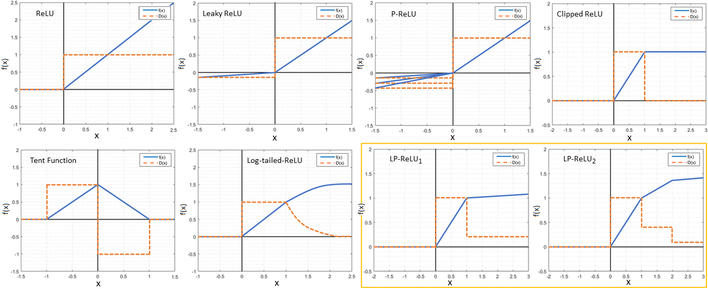
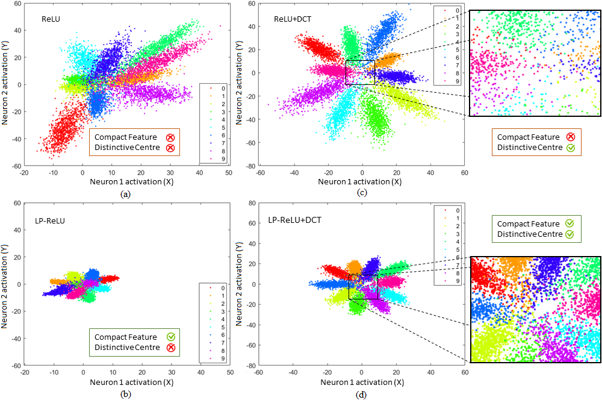
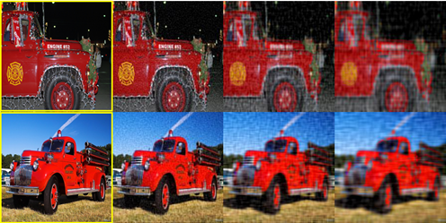
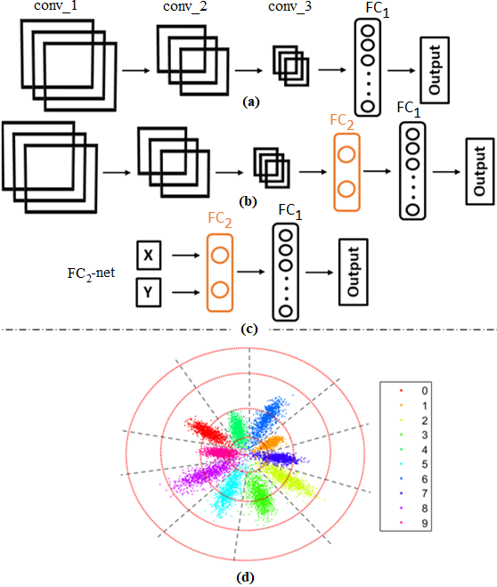
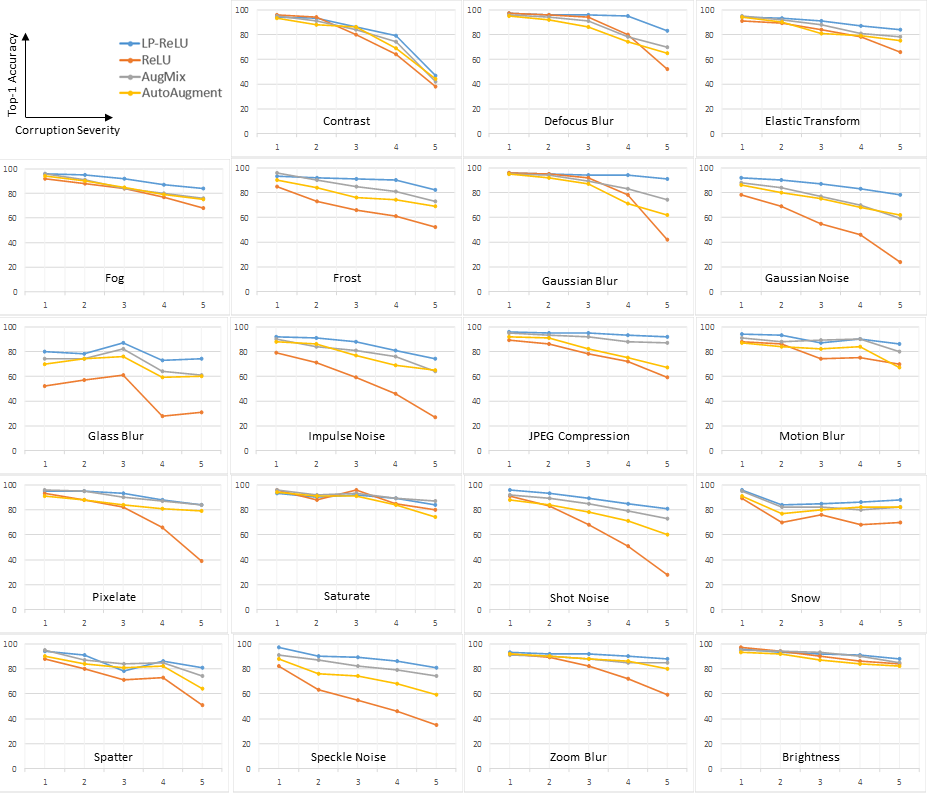
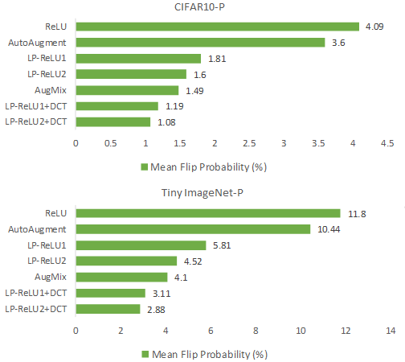

# Robust Image Classification Using A Low-Pass Activation Function and DCT Augmentation
**Different activation functions and their derivatives. The proposed Low-Pass ReLU or LP-ReLU is highlighted inside the box.**

  

**Visual Illustration of how the proposed LP-ReLU impacts the CNN feature space compared to ReLU.**

  

**Sample images generated from [DCT augmentation](https://ieeexplore.ieee.org/abstract/document/8803787).**

  

**Proposed feature and decision space visualization process.**

  

**Experimental evaluation.**

  

  

