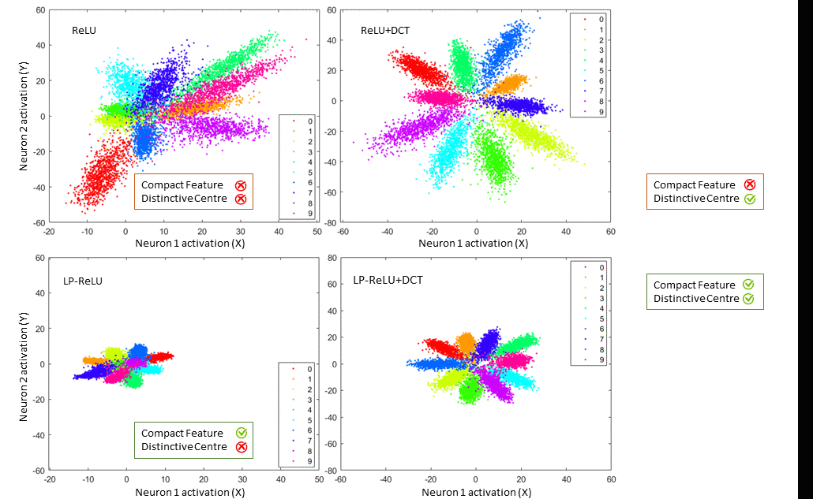

# Robust Image Classification Using A Low-Pass Activation Function and DCT Augmentation
By far, ReLU is the most widely used Activation Function in deep Convolutional Neural Networks. ReLU is simple to implement and enables deep networks to converge to training data. However, ReLU-based networks do not exhibit satisfactory robustness against corrupted data, e.g., an image with negligible noise or blur is often misclassified. Common signal processing fix to data corruption is filtering. Inspired from this, we update the existing ReLU by incorporating a built-in Low-Pass filtering mechanism (we call it LP-ReLU). We further enhance LP-ReLU's effectivenes through [DCT augmentation](https://ieeexplore.ieee.org/abstract/document/8803787).

**Different activation functions and their derivatives. The proposed Low-Pass ReLU or LP-ReLU is highlighted inside the box:**
LP-ReLU is identical to ReLU upto a certain X value and scaled down afterwards (2 variants available). LP-ReLU has a derivative almost everywhere.

  

**Visual Illustration of how the proposed LP-ReLU impacts the CNN feature space compared to ReLU:**
ReLU encourages sparsity whereas LP-ReLU enforces compactness in the feature space. Corrupted data tend to exploit sparsity leading to misclassify an input even when the corruption is visually imperceptible. Compactness in LP-ReLU network, on the other hand, makes it hard for corrupted features to drift away from where they belong. LP-ReLU is specially effective aganst High Frequency corruptions, e.g., Gaussian noise, impulse noise etc. To safeguard against low frequency corruptions like Gaussian or defocus blur, we resort to [DCT augmentation](https://ieeexplore.ieee.org/abstract/document/8803787). LP-ReLU + DCT augmentation provides measured sparsity at the center and enhanced compactness towards the perimeter.

  

**Sample images generated from [DCT augmentation](https://ieeexplore.ieee.org/abstract/document/8803787):**
Drop of information based on DC coefficients intensifies from left to right. Left most image in both rows is the clean version. 

  

**Proposed feature and decision space visualization process:**
A novel way of visualizing the feature space and learned decision boundaries. We use an additional Fully Connected layer with 2 neurons for an automatic dimension reduction of the features. This way, we do not need to use PCA or t-SNE for an approximated feature space, rather, we have the absolute features at our hands.

  

**Experimental evaluation:**
CIFAR-10-C and Tiny ImageNet-C

  

**Experimental evaluation:**
CIFAR-10-P and Tiny ImageNet-P

  

# Code guide
- Train.m is the main file to train a network from scratch.
- myresidualCIFARlgraph.m returns the desired WRN based on the arguments defined in the paper.
- LPrelu_1_Layer.m and LPrelu_1_Layer.m repesent the LP-ReLU variants proposed in the paper.
- dctData.m has the DCT augmentation functionality.
- Test_severity_level.m is used for evaluating a trained model.
- Corruption evaluation Datasets can be found [here](https://zenodo.org/record/2535967#.XxPOtCgza70) and perturbation stability datasets can be found [here](https://zenodo.org/record/2469796#.XxPPFigza70).
- LeNet_only_2FC.m and only2FC.m are used for feature and decision space visualization.

# Cite this work
